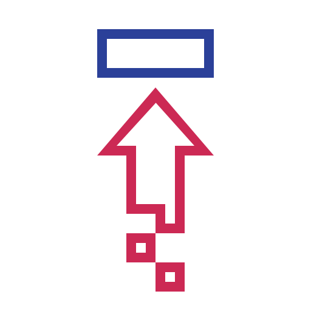

# 
🖐 Hello, I'm Serhii Hudzenko

### 
Full-Stack Developer | React, Node.js | 10+ Years in IT

With over ten years of experience in the IT industry, I have developed a deep understanding of system design, implementation, and integration. My career includes working on both non-commercial and commercial projects, where I have served as both an individual contributor and a team lead. A notable achievement is the successful creation of a commercial landing page using JavaScript, which demonstrated my ability to deliver effective solutions and achieve business goals.

In the past two years, I have focused on developing my skills as a full-stack developer, specializing in **React** and **Node.js**. My passion for technology drives me to stay at the forefront of new trends and continuously adapt my knowledge. I am currently working on enhancing my skills with frameworks like **Next.js** for improved frontend development and **NestJS** for building robust backend solutions.

I enjoy tackling complex problems and finding innovative solutions in the tech world. My goal is to continuously improve my skills and create valuable digital products. I am inspired by working on new projects and exploring the latest advancements to achieve better results and success in every project.

## My Skill Set

<table><tr><td valign="top" width="33%" align="center">

#### 
Front-end

</td><td valign="top" width="33%" align="center">

#### 
Back-end

</td><td valign="top" width="33%" align="center">

#### 
Tools

</td></tr></table>

<!-- Instuction to modify charts https://github.com/anuraghazra/github-readme-stats?tab=readme-ov-file#customization -->

## GitHub Stats

<table align="center" width="100%"><tr><td valign="top" width="50%" align="center>

</td><td valign="top" width="50%" align="center>

</td></tr></table>

<!-- <b>Note:</b> Top languages is only a metric of the languages my public code consists of and doesn't reflect experience or skill level.-->

## GitHub Trophies

 

<!--
**gudzsv/gudzsv** is a ✨ _special_ ✨ repository because its `README.md` (this file) appears on your GitHub profile.

Here are some ideas to get you started:

- 🔭 I’m currently working on ...
- 🌱 I’m currently learning ...
- 👯 I’m looking to collaborate on ...
- 🤔 I’m looking for help with ...
- 💬 Ask me about ...
- 📫 How to reach me: ...
- 😄 Pronouns: ...
- ⚡ Fun fact: ...
  -->
